# Housing and deprivation maps

The datasets were processed in python and then mapped in QGIS

## House price per square metre

## Tenure
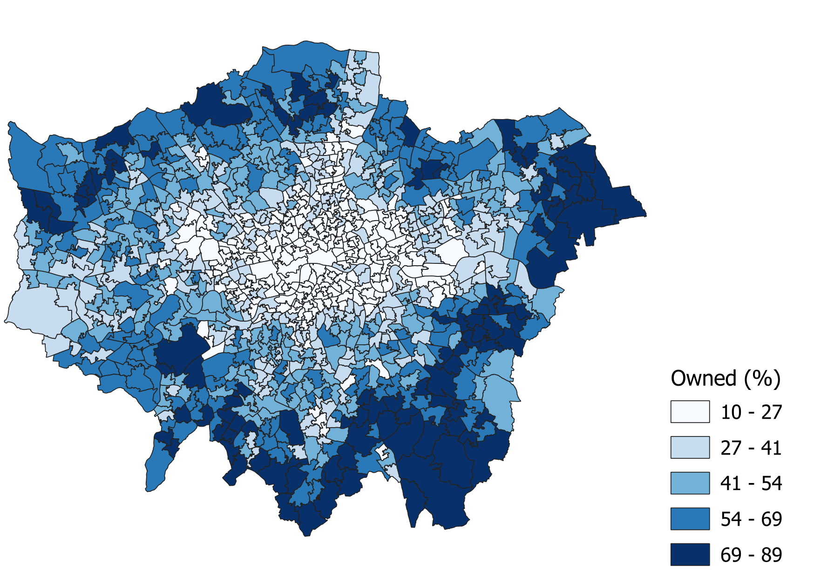
Percentage of owned dwellings, including with and without mortgage.

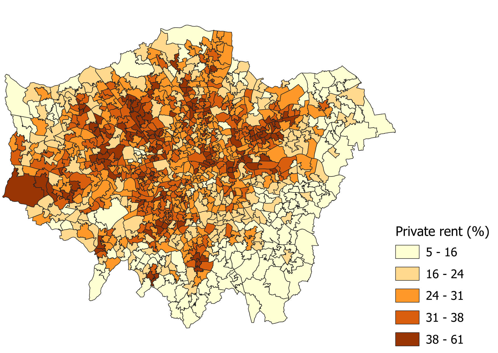
Percentage of private rent dwellings.

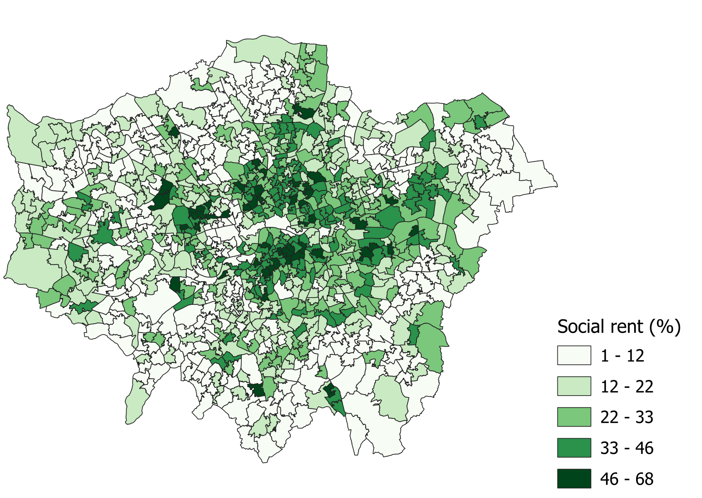
Percentage of social rent dwellings.
 
 
 

Sources: Nomis TS054: Tenure, Nomis RM204: Number of dwellings, and ONS, Open geography portal: MSOA 2021 boundaries.

## Accommodation type
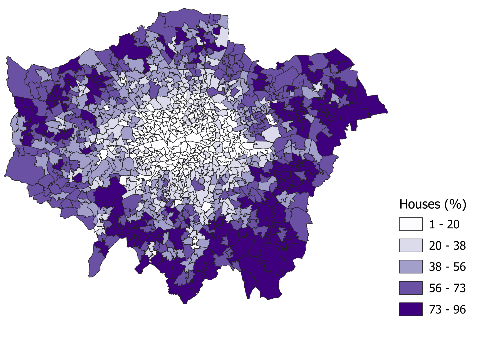
Percentage of households living in houses.

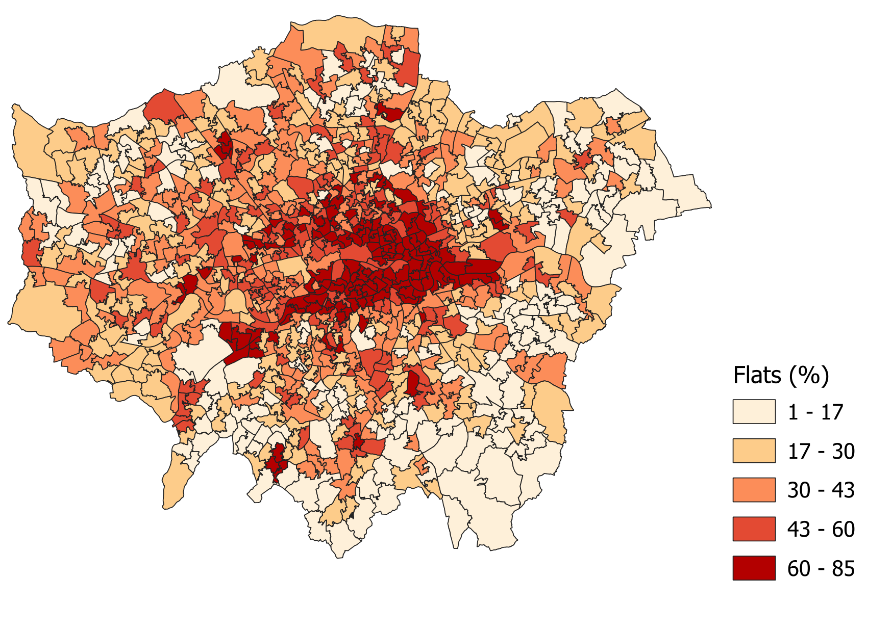
Percentage of households living in flats.

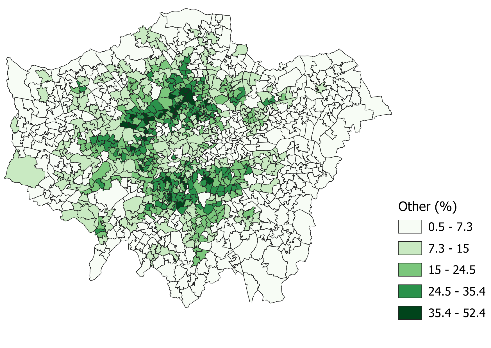
Percentage of households living in other type of accommodation: part of a converted house, commercial or other building, caravans and temporary structures.
 
 
 

Sources: Nomis TS044: Accommodation type, Nomis RM204: Number of dwellings, and ONS, Open geography portal: MSOA 2021 boundaries.

## Deprivation
Dimensions of deprivation: employment, education, health, overcrowding

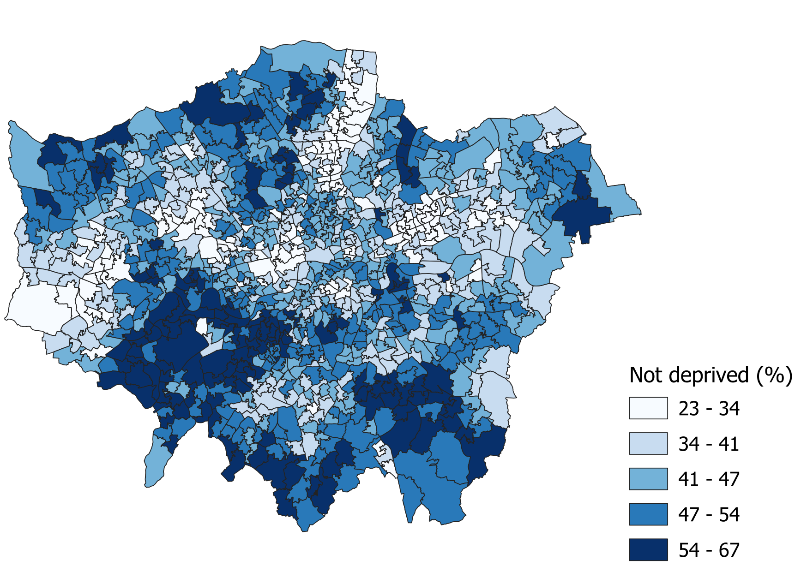
Percentage of households living without any deprivation.

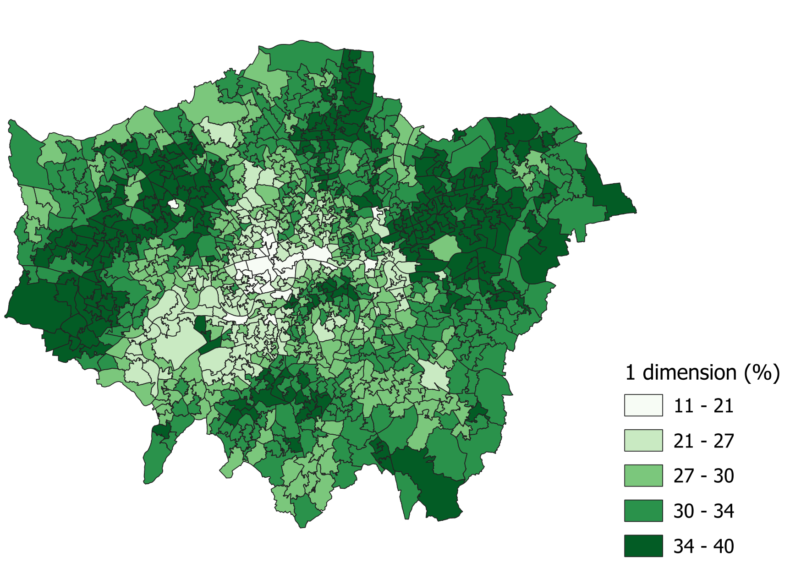
Percentage of households living with 1 dimension of deprivation.

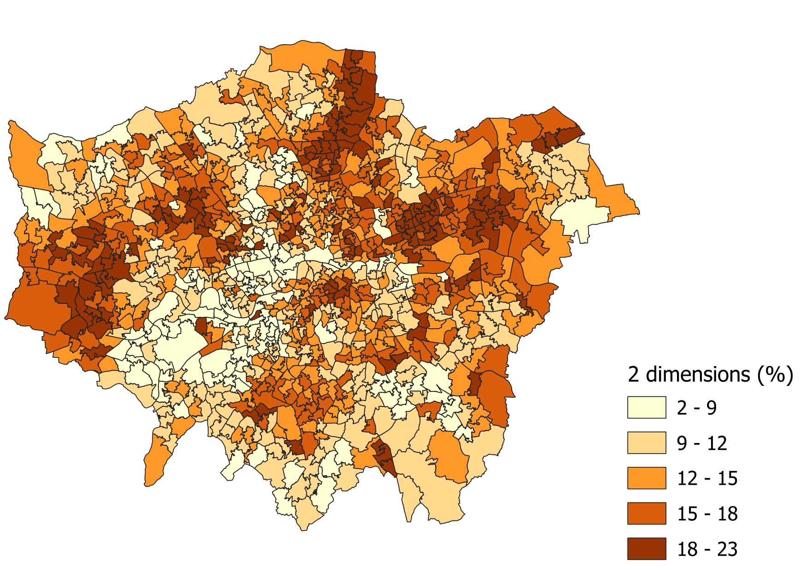
Percentage of households living with 2 dimensions of deprivation.

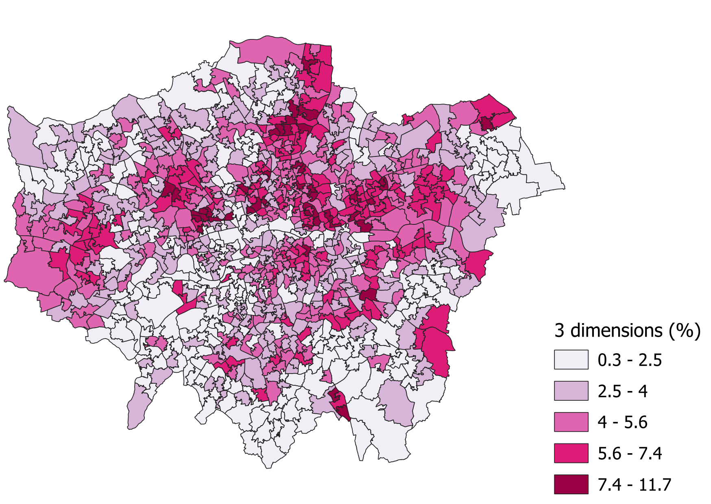
Percentage of households living with 3 dimensions of deprivation.

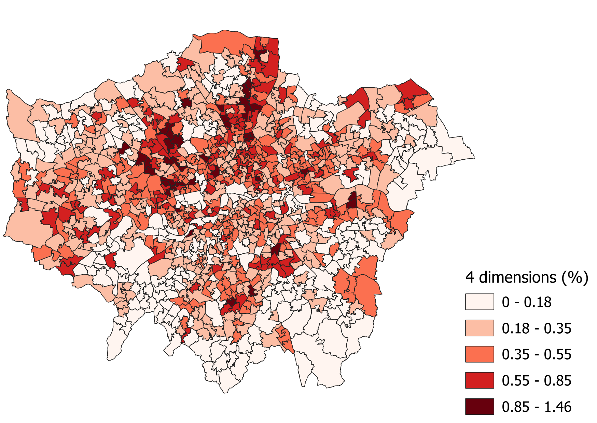
Percentage of households living with 4 dimensions of deprivation.
 
 
 

Sources: Nomis TS011: Households by deprivation dimensions, Nomis RM204: Number of dwellings, and ONS, Open geography portal: MSOA 2021 boundaries.
